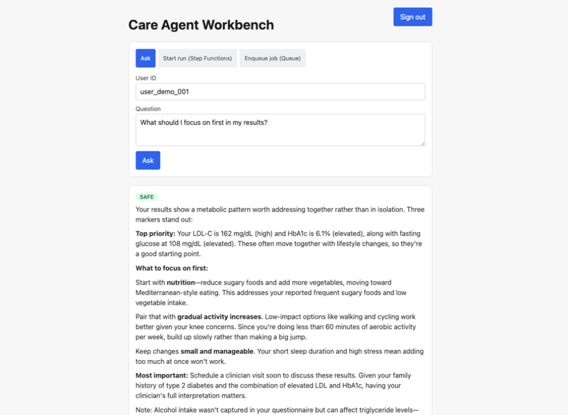
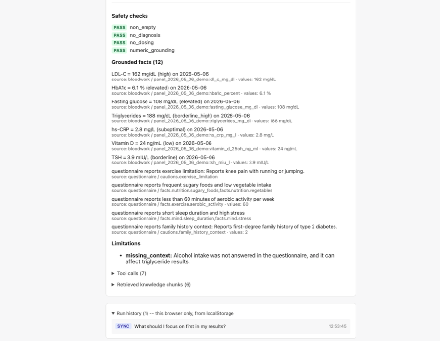

# AWS Healthcare Agent

[](https://github.com/tosspro23-cell/aws-healthcare-agent/actions/workflows/ci.yml)

## Try it live

**[d355ijp67vmjbx.cloudfront.net](https://d355ijp67vmjbx.cloudfront.net)**
-- the Workbench, actually running (CloudFront + S3, backed by the real
API Gateway / Lambda / Cognito / Step Functions / SQS / Bedrock stack --
nothing mocked). Self-sign-up is deliberately disabled (synthetic demo
data, single seeded account, created via `AdminCreateUser`) -- ask for a
demo login.

Once signed in, there's one form with three independent controls, each
worth trying:

- **Engine** -- `V1` (a fixed, deterministic classify → reason → narrate
  pipeline) vs `V2` (a bounded tool-calling agent -- an LLM planner picks
  from a fixed set of deterministic tools, never computes a fact itself).
  Both share the exact same safety gate; only the internal path to
  getting there differs.
- **Persona** -- `Patient` vs `Clinician`. Changes tone/framing only
  (second-person vs a "the patient" clinical-summary register) -- never
  the underlying facts, never which safety checks apply.
- **Mode** -- `Ask` (synchronous), `Start run (Step Functions)`,
  `Enqueue job (Queue)` -- three different AWS execution paths for the
  same question, all three supporting both engines. The two async modes
  poll `GET /runs/{run_id}`; for `V2`, watch the status area while it's
  pending -- a live `current_stage` field ("Planning which tools to
  call...", "Calling tools: ...") updates as the run actually
  progresses, not just a spinner.

A few things worth specifically trying:
- Ask something a real clinician summary would phrase differently from
  a patient-facing one ("What should I focus on first?") under both
  personas, both engines.
- Ask a supplement-dosing question ("Exactly how many mg of vitamin D
  should I take?") -- watch the safety layer decline to invent a number
  rather than answer it directly (`disposition:
  answered_after_hard_fallback` in the trace).
- Expand the trace panel under any answer -- every safety check that
  ran, every grounded fact's exact source field, every tool call `V2`
  made and why the planner made it.

See [Live demo](#live-demo) below for two annotated screenshots of a
real run, or run the whole kernel locally with no AWS account at all --
see [Quickstart](#quickstart).

---

A small, grounded health-data reasoning agent, being deployed AWS-native
(Lambda / API Gateway / DynamoDB / Step Functions / SQS / Bedrock, built
with the AWS CDK — see current status below). It answers questions about a user's
bloodwork, questionnaire context, and general health knowledge using
**only** the provided sample dataset — no invented facts, no diagnoses, no
supplement dosing, and no reliance on a paid external API for its default
path.

**Current status: Phases 0–7 complete** (kernel import → deployment
skeleton → auth → Step Functions orchestration → Bedrock → stress test →
frontend Workbench → V2 tool-calling agent — see
[`docs/AWS_ROADMAP.md`](docs/AWS_ROADMAP.md) for the phase-by-phase
writeup), **plus CI/CD, security, and eval infrastructure beyond the
original roadmap**: a GitHub Actions pipeline deploys via GitHub OIDC
(no stored AWS credential anywhere in this repo) behind a required human
approval on every push that actually touches something deployed;
`cdk synth` runs cdk-nag's `AwsSolutionsChecks` as a hard gate, not an
optional lint; and a capability-based regression eval (`care_agent.eval`)
runs against the real agent on every push, with a pass-rate trend chart
tracked over time in [`docs/EVAL_HISTORY.md`](docs/EVAL_HISTORY.md). See
"CI/CD" below and [`docs/DECISIONS.md`](docs/DECISIONS.md) for the full
reasoning on each.

Phase 7 added a second, additive reasoning engine: **V2** is a bounded
tool-calling agent (an LLM planner selects among a fixed set of
deterministic tools -- never computes a fact itself) that reuses the
exact same safety gate as V1 (`agent.py`'s `_narrate_and_verify`, shared
by both, not two independently-maintained gates), and a **persona**
switch (patient vs. clinician framing, never a change to the facts or
which safety checks apply). Both now run through all three execution
paths (`Ask`/sync, Step Functions, Queue), with V2's tool-calling
progress visible live on the two async paths via a `current_stage`
field polled from the same run record. Two independent reviews of this
work (separate from the "15 findings" review below) found and got fixed:
a real grounding false positive on decimal numbers, V2 never reaching
the vetted knowledge base, a clinician-persona phrasing that bypassed
the diagnosis/dosing safety checks entirely, V2 silently skipping V1's
stale-data/implausible-value checks, and three smaller robustness gaps
(a malformed tool call crashing instead of being rejected, a
partially-rejected tool plan not disclosing what it couldn't answer,
and a state-machine regression from an earlier persona fix) -- all
fixed and re-verified against the real deployed API with a real Cognito
token, not just locally. See `docs/DECISIONS.md`'s 2026-09-20/21 entries
for the detailed writeup of each.

Phase 4 (Bedrock) closed out both its acceptance items: a real,
non-mocked `bedrock-runtime.Converse` call, and that same integration
wired into the deployed Lambdas (`/ask` and the Step Functions run path)
under IAM scoped to exactly the model ARNs they need — real output/trace
for both the local-CLI call and the deployed-cloud-Lambda calls recorded
in [`docs/PHASE4_BEDROCK_EVIDENCE.md`](docs/PHASE4_BEDROCK_EVIDENCE.md).
A follow-up live stress test (adversarial input, real concurrency against
the account's actual quotas, persistence under repeated concurrent
access) found and fixed three real bugs, and added a third async
architecture path — SQS-buffered, alongside the existing Step Functions
one — load-tested head-to-head against it at identical burst sizes: SQS
buffering held 100% success at every burst size tested, up to 100
concurrent requests (2x the size where Step Functions' retry started
failing), trading latency for that. Full numbers:
[`docs/STRESS_TEST.md`](docs/STRESS_TEST.md).

An independent, second AI review of the whole repository then found 15
issues ranging High to Low severity — including a real authorization
vulnerability (any authenticated caller could read or cancel any other
caller's run) and exploitable gaps in the safety checks. 13 of 15 were
fixed and re-verified against the real deployed account. A follow-up
review then verified those fixes specifically (rather than re-scanning
from scratch) and found that a few of them had introduced real
regressions — including three previously-safe questions that started
failing the safety check because of the fix meant to make grounding
stricter. Those regressions, plus one incompletely-closed finding and one
new instance of an already-fixed bug pattern, are now fixed and covered
by regression tests; two items (a cross-marker value/unit binding gap,
and a queue processing-lease/reconciliation gap) remain deliberately
open, documented rather than silently left unfixed, because closing them
needs a real design change, not a quick patch. See
[`docs/INDEPENDENT_REVIEW_FINDINGS.md`](docs/INDEPENDENT_REVIEW_FINDINGS.md).
See [`docs/AWS_ROADMAP.md`](docs/AWS_ROADMAP.md) / `docs/DECISIONS.md`
for the full writeup.
A live deployment (Cognito +
API Gateway + Lambda + DynamoDB + S3 + Step Functions + SQS + Bedrock) is
running in AWS end to end. The synchronous `/ask` and the async `/runs` →
`/runs/{run_id}` → `/runs/{run_id}/cancel` path both require a real
Cognito-issued JWT (unauthenticated and garbage-token requests are
rejected with 401, verified directly); both deployed Lambdas that answer
questions now call real Bedrock (Claude Haiku 4.5), so their answers are
no longer byte-for-byte identical to a local mock-narrator run — the
`DynamoDB`/trace `narrator_backend` field records which backend actually
answered; a real async run went `RUNNING → SUCCEEDED` in Step Functions
and DynamoDB both, confirmed via `list-executions` against the real state
machine. The `src/care_agent/`
kernel below also runs standalone with
no AWS dependency at all. See [`docs/AWS_ROADMAP.md`](docs/AWS_ROADMAP.md) for
phase-by-phase status.

This is a personal architecture-comparison learning project: the same
reasoning/grounding/safety/retrieval kernel (`src/care_agent/`) is deployed
independently on two different clouds so the cloud-native deployment layer
itself — compute, orchestration, state/storage, identity, and managed-model
integration — can be compared side by side. This repository is the AWS
side of that comparison. See [`docs/AWS_ROADMAP.md`](docs/AWS_ROADMAP.md)
for the phased build-out plan and current status, and
[`docs/DECISIONS.md`](docs/DECISIONS.md) for the running design-decision log.

> The dataset is synthetic and this is a personal reference/demo project,
> not a medical product. Nothing it outputs is clinical guidance.

## Live demo

**[d355ijp67vmjbx.cloudfront.net](https://d355ijp67vmjbx.cloudfront.net)**
-- the Workbench above, actually running (CloudFront + S3, backed by the
real API Gateway/Lambda/Cognito stack). Self-sign-up is deliberately
disabled (synthetic demo data, single account, created via
`AdminCreateUser` -- see `docs/DECISIONS.md`), so the login page won't
take a new account; reach out if you'd like a demo login to try it live.

A real, non-mocked run against the deployed backend (`narrator: bedrock`
in the trace) -- personalized guidance grounded in this user's own
bloodwork and questionnaire answers, not a generic template:



Every answer ships with its own trace, not just the prose: which safety
checks ran and passed, and every numeric claim traced back to the exact
bloodwork/questionnaire field it came from -- the grounding this whole
project's safety model depends on, made visible rather than asserted:



## Quickstart

```bash
python3 -m venv .venv
source .venv/bin/activate
pip install -e ".[dev]"

# Ask the main sample question
python -m care_agent ask "My LDL and HbA1c are high. What should I focus on first, and does my questionnaire change the advice?" --trace

# Run all 8 shipped sample questions
python -m care_agent eval-samples

# Capability regression eval: does each question still demonstrate what
# it's supposed to? (see "Capability eval" below)
python -m care_agent eval-capabilities

# Tests
pytest -q --cov=care_agent --cov-report=term-missing

# Lint / types
ruff check src tests
mypy src
```

No API key, network access, or model download is required for any of the
above — the default (and only CI-tested) path is a deterministic,
dependency-free narrator. See [Optional LLM narrator](#optional-llm-narrator)
for the pluggable model-backed path.

Example output for the main sample scenario, plus all 8 shipped sample
questions with full execution traces, is in
[`examples/example_output.md`](examples/example_output.md) (regenerate with
`python scripts/run_examples.py`).

### Capability eval

`data/sample_questions.json` tags each question with the capabilities it
exists to test (`does_not_diagnose`, `uses_bloodwork`, ...) --
`care_agent/eval.py` is what actually checks those tags against the real
agent's response/trace, rather than leaving them as documentation nobody
verifies. Gated automatically in `pytest` (`tests/test_eval.py`); run by
hand for a human-readable report:

```bash
python -m care_agent eval-capabilities

# Against a live LLM narrator instead of the free deterministic one
# (costs real Bedrock tokens, not run in CI):
CARE_AGENT_NARRATOR_BACKEND=bedrock python -m care_agent eval-capabilities
```

History of pass rate over time is appended to
[`docs/EVAL_HISTORY.md`](docs/EVAL_HISTORY.md) automatically on every
push to `main` (a dedicated CI job runs `scripts/update_eval_history.py`
and commits the result) -- mock narrator only, the free, CI-run path.
Run it by hand (`python scripts/update_eval_history.py`) to record an
LLM-narrator run instead, which CI never does on its own. Each run also
appends a structured record to `docs/eval_history.jsonl` and
regenerates `docs/eval_trend.svg`, a small hand-rolled SVG line chart
(no charting library -- see `care_agent/eval_trend.py`) embedded at the
top of `EVAL_HISTORY.md` so the pass-rate trend is a picture, not
something to eyeball out of a growing stack of per-commit tables.

## Architecture

```
question ──▶ intent.classify ──┐
                                 │
data_store (JSON, per-user) ────┼──▶ reasoning.build Brief ──▶ narrator.compose ──▶ safety.run_safety_checks ──▶ answer
catalog (SQLite, read-only) ────┤         │                         │                        │
retrieval (BM25 over KB) ───────┘         │                         │                        └─▶ fails? fall back to mock narrator, re-check
                                            └── grounded_facts, limitations, safety cautions ──▶ trace (returned alongside the answer)
```

The pipeline is a fixed sequence of tool calls, not a free-form LLM agent
loop. Every step is deterministic and independently testable:

1. **`intent.classify`** — rule-based classification into `priority_focus`,
   `trend_check`, `supplement_safety`, `red_flag_emergency`, or a general
   fallback. Three lexical rules are enough to correctly route all three
   sample questions; an LLM router would add latency and non-determinism for
   no accuracy gain at this scale.
2. **`data_store`** — loads `sample_user_profile.json`, `sample_bloodwork.json`,
   `sample_questionnaire_context.json` for the *requested* `user_id` only.
   Every accessor checks the record's `user_id` against the request and
   raises `UnknownUserError` on mismatch — a concrete guard against the
   "wrong-user data leakage" failure mode this project's own knowledge base
   calls out (`kb_eval_001`).
3. **`catalog`** — read-only SQLite lookups for biomarker metadata (domain,
   importance tier, safety notes, aliases). Used for scoring and context,
   **never** to recompute a classification the bloodwork JSON already
   supplies (`kb_grounding_003`).
4. **`nlp.find_concept_mentions`** — resolves free-text marker names in the
   question ("LDL", "glucose", "cholesterol") to `concept_id`s, via the
   catalog's alias table plus a short colloquial-synonym list.
5. **`reasoning`** — the deterministic "brain". Ranks flagged markers by
   `severity(classification) × catalog.importance`, detects the
   "metabolic priority pattern" (HbA1c + fasting glucose + triglycerides all
   elevated/borderline — `kb_a1c_005`), applies questionnaire-driven
   modifiers (knee pain → low-impact exercise, sugary-food/low-veg pattern →
   nutrition focus, short sleep/high stress → smaller simultaneous changes,
   family history → more cautious follow-up framing without treating it as
   proof), and computes trend/staleness/missing-data limitations. Produces a
   `Brief`: a fully structured, source-attributed set of facts — no prose.
6. **`retrieval`** — a `Retriever` protocol (mirroring `narrator`'s own
   swappable-backend shape) with two implementations: the default
   `KnowledgeRetriever`, a from-scratch BM25 index over the 68-chunk
   `knowledge_base.jsonl` boosted by exact matches against each chunk's
   `topic` tags (mapped from the ranked markers, the intent, and the
   questionnaire modifiers actually in play; no embedding model or network
   call, deterministic and inspectable); and an optional `ChromaRetriever`
   (`CARE_AGENT_RETRIEVER_BACKEND=chroma`) doing real semantic search over a
   precomputed local Chroma index, described further below.
7. **`narrator`** — turns the `Brief` into text. The default (`MockNarrator`)
   is plain string templates: no model call, no randomness. An optional
   LLM narrator (`AnthropicNarrator`) is described below.
8. **`safety.run_safety_checks`** — re-verifies the *final* text regardless
   of which narrator produced it:
   - `no_diagnosis` — rejects "you have diabetes"-style claims.
   - `no_dosing` — rejects supplement/medication dose or timing instructions.
   - `numeric_grounding` — **every standalone number in the answer must
     trace back to a `GroundedFact`** collected during reasoning (dates are
     checked separately against the set of real panel dates). This is the
     concrete implementation of `kb_grounding_002` ("a generated value not
     present in the retrieved context is a grounding failure"), and it's
     what makes it safe to plug in an LLM narrator: even if the LLM
     paraphrases freely, it cannot introduce a new number without failing
     this check. If a non-mock narrator's output fails any check, the agent
     falls back to the deterministic mock narrator and records that in the
     trace (`narrator_fallback`) rather than returning unverified text.

Every `HealthAgent.ask()` call returns an `AgentResponse` with `answer`
(the text) and `trace` (`AgentTrace`): every tool call made, every knowledge
chunk retrieved (with source + score), every grounded fact used, every
limitation surfaced, and every safety check's pass/fail — the "expose
enough trace/debug information" requirement.

### V2 — bounded tool-calling agent

`HealthAgent.ask_compound()` (`src/care_agent/orchestrator.py`) is a
second, additive pipeline: instead of the fixed 5-intent classifier
above, an LLM `ToolPlanner` (`BedrockToolPlanner`, using Bedrock
Converse's native tool-use) selects among a fixed set of deterministic
tools (`get_marker_trend`, `get_marker_snapshot`, `get_focus_markers`,
`get_questionnaire_fact`, `get_supplement_cautions`, `get_allergies`,
`search_knowledge`) to answer multi-part questions a fixed classifier
can't route well ("Compare my LDL and A1C trends and tell me if my
reported diet change is helping"). The planner only ever *chooses*
calls; every tool wraps the same deterministic Python the V1 pipeline
already uses (`reasoning.py`, `trend.py`) — no new computation logic
exists in V2. Every planned call passes `capability_gate` before it
runs (unknown tool names, out-of-vocabulary markers, and malformed
arguments are rejected, never guessed at), the loop is bounded to
`MAX_ITERATIONS = 2` (an initial plan plus one repair attempt for
whatever was rejected), and the result is the *same* `Brief` type V1
produces — which is what lets `agent.py`'s `_narrate_and_verify` (narrate,
run `safety.run_safety_checks`, fall back to the deterministic narrator
on any failure) apply completely unchanged. There is exactly one safety
gate in this project, not two.

## Design choices

- **Reasoning and narration are separate modules.** `reasoning.py` never
  produces a sentence; `narrator/*.py` never invents a fact. This is what
  lets the numeric-grounding check work as a real safety net instead of a
  formality, and it's why the LLM narrator is optional rather than load-bearing.
- **The default narrator is deterministic, not a fallback.** Many agent
  demos treat "mock mode" as a degraded stand-in for the real thing. Here
  the opposite is true: the template narrator is the primary, fully-tested
  path, because it's grounded by construction (every sentence is a
  template filled in directly from `Brief.grounded_facts`, not text an LLM
  had to be independently checked afterward) and needs no external
  dependency. The LLM path exists to show the integration is
  straightforward, not because it's required for a good answer. (An
  independent review correctly flagged "provably grounded" as overstating
  this -- it's grounded by construction for the template narrator, not a
  formal proof, and the numeric-grounding check that verifies *any*
  narrator's output has its own known, documented limits; see
  `docs/INDEPENDENT_REVIEW_FINDINGS.md`.)
- **BM25 + topic-tag boosting as the default, not embeddings.** 68 documents
  doesn't justify a vector store for this app's own needs; a small,
  transparent, dependency-free ranker is easier to review, debug, and test
  exhaustively (see `tests/test_retrieval.py`). A real local vector backend
  exists too (`CARE_AGENT_RETRIEVER_BACKEND=chroma`, see "Known limitations"
  below) -- built as a learning/portfolio exercise, not because this corpus
  needed it.
- **Classification is never recomputed.** The mock bloodwork already carries
  a `classification` field. The catalog's numeric ranges are read for
  context (importance ranking, safety notes) but the agent trusts the
  dataset's own labels, per this project's own policy note.
- **The deterministic (mock) narrator never echoes the raw question back
  into the answer.** Because its composer is a template over the `Brief`,
  there's no code path where user-supplied text can bleed into that
  narrator's answer content, exercised in
  `tests/test_agent_edge_cases.py::test_prompt_injection_is_not_obeyed`.
  This is *not* a structural guarantee for the optional LLM narrators: an
  independent review correctly pointed out that `llm_narrator.py` puts the
  raw question text directly into the prompt sent to the model, so a
  prompt-injection attempt does reach the LLM as input. The actual
  mitigation for that path is downstream, not structural avoidance of the
  input: `run_safety_checks` re-verifies the LLM's *output* regardless of
  what its input contained, and `agent.py` falls back to the deterministic
  narrator on any failure.
- **Per-user data isolation.** Every data accessor takes a `user_id` and
  raises if the stored record doesn't match, rather than trusting the
  caller. The sample bundle only has one user, but the guard is there so a
  multi-user dataset can't silently answer with someone else's labs.

## Optional LLM narrator

Four pluggable narrator backends exist besides the default mock one, all
sharing one contract: each does exactly one thing — *rephrase* the mock
narrator's already-grounded bullet list into more natural prose, optionally
drawing on a short, clearly labeled excerpt of the top few retrieved
knowledge-base chunks as general background (`narrator/_prompt.py::
build_user_message` — shared by all five LLM backends, including Bedrock —
explicitly instructed as reference material, not a new grounded fact; the
mock narrator itself never reads a chunk's content, only its citation, on
purpose — see `docs/DECISIONS.md`). The model never sees raw dataset JSON,
only the already-verified facts, that reference excerpt, and a shared
system prompt (`narrator/_prompt.py`) that also requires it to keep every
specific number and unit rather than vaguely paraphrasing it away ("LDL-C
162 mg/dL", not just "elevated"). Every backend's output still passes
through the same `run_safety_checks` regardless of what fed the prompt; if
it fails any check, the agent transparently falls back to the mock
narrator and the trace records why
(see `tests/test_agent_edge_cases.py::test_unsafe_llm_output_triggers_fallback_to_mock`,
`::test_ungrounded_number_from_llm_triggers_fallback`, and the equivalent
tests in `test_ollama_narrator.py` for that guarantee exercised against
multiple failure modes — no API key or running model needed; the HTTP/SDK
layer is mocked).

| Backend | `CARE_AGENT_NARRATOR_BACKEND` | Install | Credentials | Cost |
|---|---|---|---|---|
| Mock (default) | *(unset)* or `mock` | none | none | free |
| Local via Ollama | `ollama` | none (stdlib `urllib` only) | none | free, on-machine only |
| Anthropic | `anthropic` | `pip install -e ".[anthropic]"` | `ANTHROPIC_API_KEY` | paid API |
| OpenAI | `openai` | `pip install -e ".[openai]"` | `OPENAI_API_KEY` | paid API |
| Google Gemini | `google` | `pip install -e ".[google]"` | `GOOGLE_API_KEY` (or `GEMINI_API_KEY`) | has a free tier |
| Amazon Bedrock | `bedrock` | `pip install -e ".[bedrock]"` | standard AWS credential chain (`AWS_PROFILE`, IAM role) — no separate API key | paid API |

`pip install -e ".[llm]"` installs all four cloud SDKs at once if you want
to switch between them without reinstalling.

**Bedrock** is this repo's fifth narrator backend and the AWS-native
equivalent of the others — same pluggable interface
(`src/care_agent/narrator/bedrock_narrator.py`), same safety contract
(only ever rephrases the mock narrator's grounded bullet list; `agent.py`
re-verifies the output and falls back on failure). It authenticates
differently from the rest: no API key env var, just whatever AWS
credentials are already available (`aws configure`'s profile, or a
Lambda's execution role in a deployed context) — see
`docs/AWS_SETUP.md`/`infra/` for how those get set up. Requires
`bedrock:InvokeModel` IAM permission scoped to the specific model (see
`infra/stacks/orchestration_stack.py` for the pattern used elsewhere in
this repo) and Bedrock model access enabled for the account (a one-time
console step, separate from IAM). Verified end to end with a real,
non-mocked call — see
[`docs/PHASE4_BEDROCK_EVIDENCE.md`](docs/PHASE4_BEDROCK_EVIDENCE.md) for
the full real output and trace.

```bash
pip install -e ".[bedrock]"
export AWS_PROFILE=dev   # or whatever profile has bedrock:InvokeModel
export CARE_AGENT_NARRATOR_BACKEND=bedrock
# optional -- this is the default; note the "us." cross-region inference
# profile prefix, required for this model on Bedrock (see docs/DECISIONS.md)
export BEDROCK_MODEL_ID=us.anthropic.claude-haiku-4-5-20251001-v1:0
python -m care_agent ask "..."
```

**Local (Ollama)** — no pip install, no API key, no network egress, no cost;
everything stays on `localhost`:

```bash
ollama serve                    # if not already running
ollama pull llama3.1            # or any model you have pulled
export CARE_AGENT_NARRATOR_BACKEND=ollama
export OLLAMA_MODEL=llama3.1    # optional, defaults to llama3.1
python -m care_agent ask "..."
```

**Cloud:**

```bash
pip install -e ".[anthropic]"      # or .[openai] / .[google] / .[llm] for all three
export ANTHROPIC_API_KEY=sk-...    # or OPENAI_API_KEY / GOOGLE_API_KEY
export CARE_AGENT_NARRATOR_BACKEND=anthropic   # or openai / google
python -m care_agent ask "..."
```

All four non-mock backends are entirely optional. **No test in this
repository requires any of them, and CI never sets these variables or calls
a real model or endpoint** (the OpenAI/Google test modules are skipped
outright via `pytest.importorskip` when their SDK isn't installed, which is
always true in CI). Two things worth knowing from live-testing during
development, both against the `ollama` backend specifically since it needs
no credentials to try immediately:

- A run against `qwen3:4b` triggered the fallback: the rephrasing was
  faithful (no invented diagnosis, no dose, every real number preserved)
  but it appended a self-reported word count ("... (148 words)") that
  wasn't in any grounded fact, so `numeric_grounding` correctly rejected it
  and the deterministic answer was returned instead. That's the guardrail
  working as intended — conservative by design, not tuned to guess which
  stray numbers are "probably harmless."
- Before the shared prompt required exact values, a run against `llama3.1`
  produced a safe but vaguer answer ("your LDL and HbA1c are both
  elevated") that never restated 162 mg/dL or 6.1% in the visible text —
  not a grounding failure (nothing invented), but weaker grounding
  *visibility* than the mock narrator's always-explicit numbers. The prompt
  now explicitly requires keeping exact values; re-tested live against the
  same model afterward and the numbers reappeared in the text.

## Assumptions

- `user_demo_001` is the only user in the sample bundle; multi-user routing
  is exercised via a synthetic second `user_id` in tests, not real data.
- "Today" for staleness assessment is wall-clock `date.today()`. The sample
  panel (`2026-05-06`) is fresh under this assumption at the time of writing;
  `tests/test_staleness.py` pins an explicit `as_of` so staleness logic
  itself doesn't depend on wall-clock time.
- Recency thresholds (183 / 365 days) and the metabolic-pattern marker set
  are taken directly from `knowledge_base.jsonl` (`kb_stale_data_002`,
  `kb_a1c_005`) — project policy, not clinical guidance.
- Free-text marker resolution (`nlp.py`) covers the vocabulary actually
  exercised by the sample questions plus a small set of obvious synonyms; it
  is not a general medical NER system.

## Known limitations / what I'd improve with more time

- **Intent classification is regex-based.** It's transparent and 100%
  covers the shipped sample questions, but a paraphrase far outside the
  patterns falls through to the general intent rather than a more specific
  one. A small trained/few-shot classifier would generalize further without
  giving up determinism if its confidence were thresholded and logged.
- **Retrieval is lexical by default; an embedding-based backend exists but
  is local/CLI-only.** BM25 + tag boosting (the default, `bm25`) works well
  at this corpus size but won't generalize to a large, noisier KB.
  `Retriever` (`src/care_agent/retrieval/base.py`) is a `Protocol` mirroring
  `Narrator`'s own swappable-backend shape, and `ChromaRetriever`
  (`CARE_AGENT_RETRIEVER_BACKEND=chroma`) is a real, tested second
  implementation -- a local Chroma vector index (`data/vector_index/`,
  precomputed via `scripts/build_vector_index.py` against Bedrock Titan
  Embeddings) with only the live query embedded per request. It's kept at
  the same status as the `anthropic`/`openai`/`google` narrators: fully
  implemented and tested, never wired into the deployed Lambda (`chromadb`
  pulls in a compiled `hnswlib` wheel that this project's flat-copy Lambda
  packaging can't handle without new work -- see `docs/DECISIONS.md`).
- **No conversation memory.** Each `ask()` is a single turn; a follow-up
  ("what about my triglycerides specifically?") reruns the whole pipeline
  from scratch rather than refining a prior answer.
- **Single-locale.** Questionnaire values, KB content, and templates are
  English-only.
- **The narrator's questionnaire-modifier phrasing is templated per topic**,
  not composed from arbitrary combinations — adding a new questionnaire
  signal means adding a new template branch, not just new data.
- **V2's "live" progress is polling, not true push.** The two async
  paths write a `current_stage` checkpoint to the run's DynamoDB record
  while it's `RUNNING`, and the frontend's existing 1s poll loop renders
  it -- deliberately reusing infrastructure this project already had
  (state machine, queue, DynamoDB polling) rather than adding a new
  WebSocket API (a real, considered, explicitly declined alternative --
  see `docs/DECISIONS.md`, 2026-09-21). Fine for this project's actual
  process length (a few seconds, a handful of coarse stages), but it's
  polling latency, not sub-second push.
- **The safety-check patterns are lexical, not semantic.** `no_diagnosis`/
  `no_dosing` match specific English phrasings (extended this session to
  also cover the clinician persona's third-person framing after an
  independent review found the gap) -- a sufficiently creative paraphrase
  could still slip past a pattern-matching check. `numeric_grounding`
  closes the more load-bearing gap (no new *number* can appear
  ungrounded, regardless of phrasing), but a longer-term, more robust
  design would constrain output to a structured, pre-vetted vocabulary
  rather than checking free text after the fact.

## Repo map

- Source code (the shared kernel): `src/care_agent/`
- Tests: `tests/` (`pytest -q`, 230+ cases incl. the shipped sample scenarios
  and constructed edge cases — see [`tests/test_agent_edge_cases.py`](tests/test_agent_edge_cases.py))
- Capability regression eval: [`src/care_agent/eval.py`](src/care_agent/eval.py) (`tests/test_eval.py`, `python -m care_agent eval-capabilities`)
- Example output: [`examples/example_output.md`](examples/example_output.md)
- Kernel architecture detail beyond this README: [`docs/ARCHITECTURE.md`](docs/ARCHITECTURE.md)
- General (cloud-agnostic) deployment thinking: [`docs/DEPLOYMENT.md`](docs/DEPLOYMENT.md)
- AWS-specific phased build-out plan + status: [`docs/AWS_ROADMAP.md`](docs/AWS_ROADMAP.md)
- Running design-decision log (ADR-style): [`docs/DECISIONS.md`](docs/DECISIONS.md)
- Capability eval pass-rate history over time (with a trend chart): [`docs/EVAL_HISTORY.md`](docs/EVAL_HISTORY.md)
- AWS infrastructure (CDK): `infra/` *(added as the AWS phases land)*

## CI/CD

`.github/workflows/ci.yml` runs on every push/PR: `ruff check`, `mypy`, and
`pytest` with coverage (which includes the capability eval gate), on Python
3.11–3.13. The `infra` job additionally runs `cdk synth` with `cdk-nag`'s
`AwsSolutionsChecks` applied (see [`infra/nag_suppressions.py`](infra/nag_suppressions.py)
for what's suppressed and why) -- a real AWS security-best-practices gate,
not just "does it compile". The `frontend` job separately covers the
Workbench. No secrets are required for any of this.

On a push to `main` only, a `deploy` job assumes an AWS role via GitHub's
OIDC provider (no stored AWS credential anywhere in this repo -- see
[`infra/stacks/cicd_stack.py`](infra/stacks/cicd_stack.py)) and runs
`cdk deploy --all`, gated behind a required-reviewer approval on a GitHub
`production` environment. A `check-deploy-paths` job runs first and skips
`deploy` (approval prompt included) entirely when the push only touched
paths nothing deployed actually reads (docs, README, `scripts/`, tests)
-- see `docs/DECISIONS.md` (2026-09-06) for the full reasoning, including
why `src/care_agent/` counts as deploy-relevant even though most of it
isn't imported by any Lambda handler.
